# Meeting Room Booking System
Meeting Room Booking System, built using Laravel 7 framework. Designed with simplicity in mind, the system streamlines the process of reserving meeting rooms, ensuring a hassle-free experience for both users and administrators. 

Users can easily prebook meeting rooms before their scheduled meetings. The administrative side allows swift management of booking requests, where admins can accept or reject requests promptly. Users receive real-time status updates on their booking requests, keeping them informed every step of the way. Furthermore, the admin interface also empowers administrators to configure user and room settings effortlessly, providing flexibility to adapt to any organization's unique needs.


# Installation

### Installation Steps
1. Clone the repository using **git clone**.
2. Navigate to the folder and install dependencies.
	```
	cd your-folder-name
	composer install
	npm install
	```
3. Configre environment.
	```
	cp .env.example .env
	php artisan key:generate
	```
4. Set up Database.
* Update **`.env`** with database details.
	```
	php artisan migrate --seed
	```
6. Compile assets and serve.
	```
	npm run dev
	php artisan serve
	```

# Usage
### User
1. User must have an account to log in to the system. 
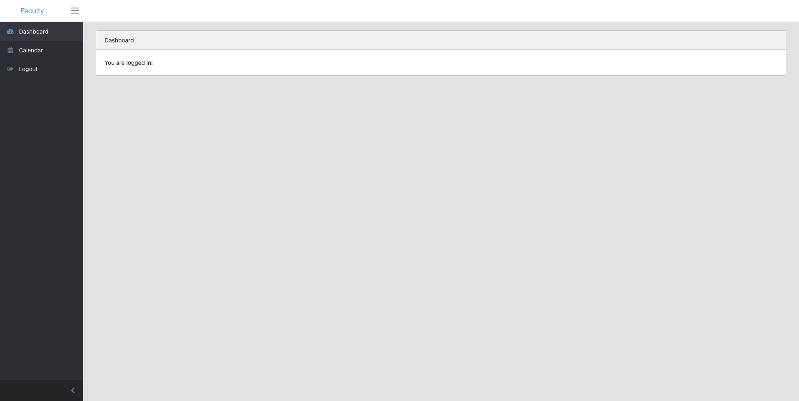
2. Select available rooms in the room options, and click **'Book Room'**
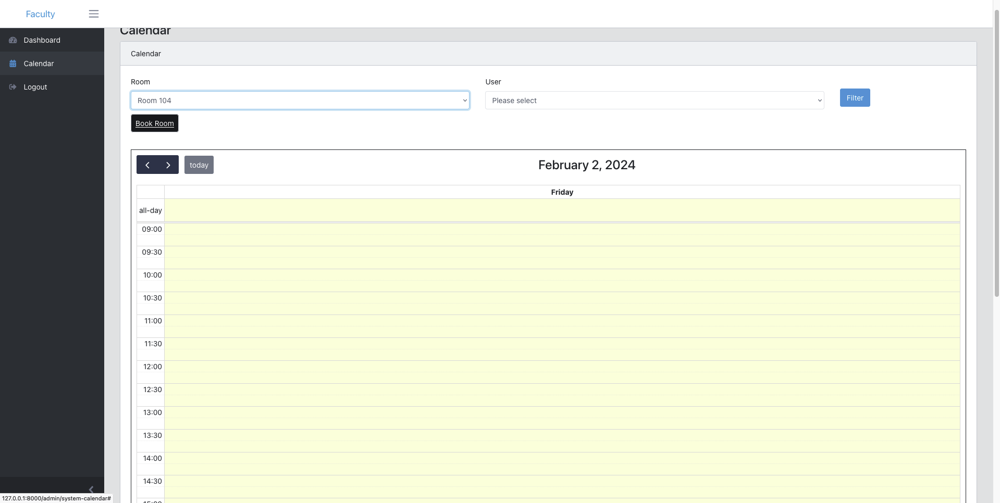
3.  Fill in relevant details for the booking. Once done, submit the booking form and confirm the details.
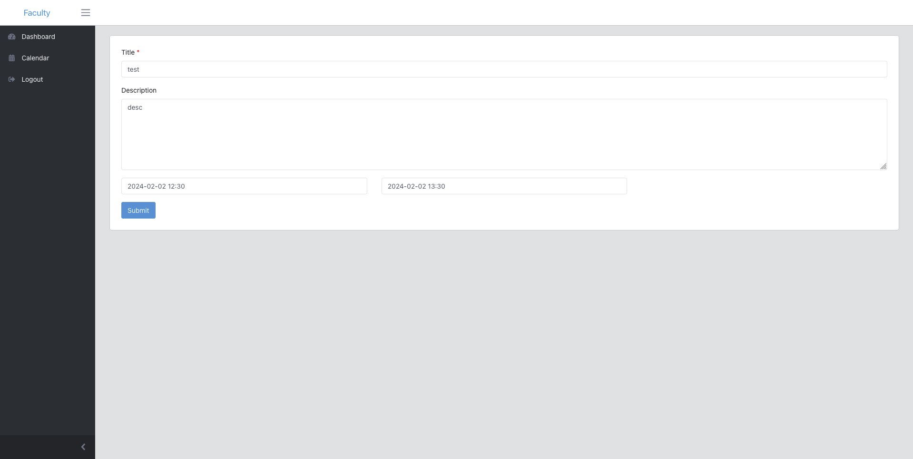
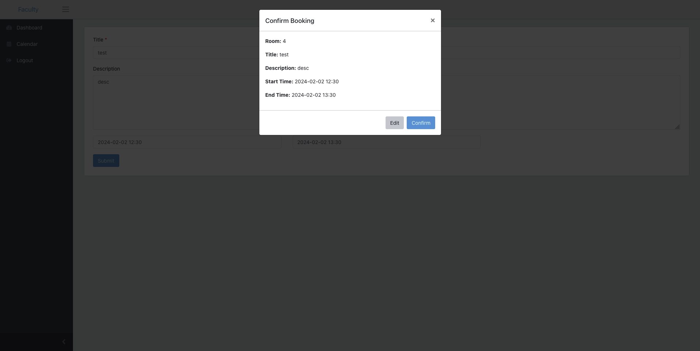
4. User will receive email for their booking.
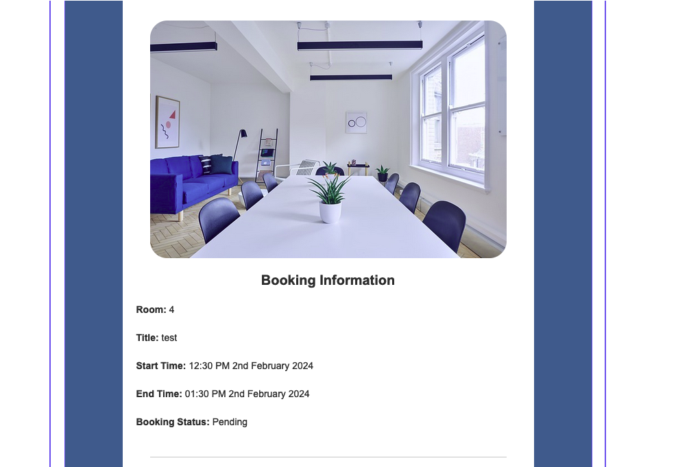
5. Once admin has approved, user will receive another email for booking status update. Refresh site to display user booking on calendar.
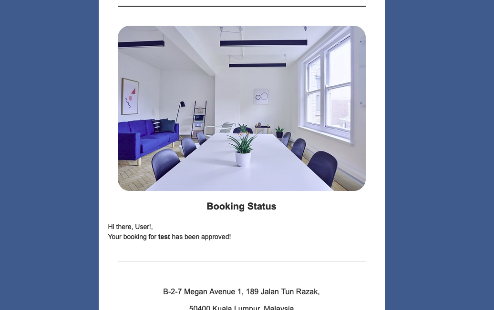
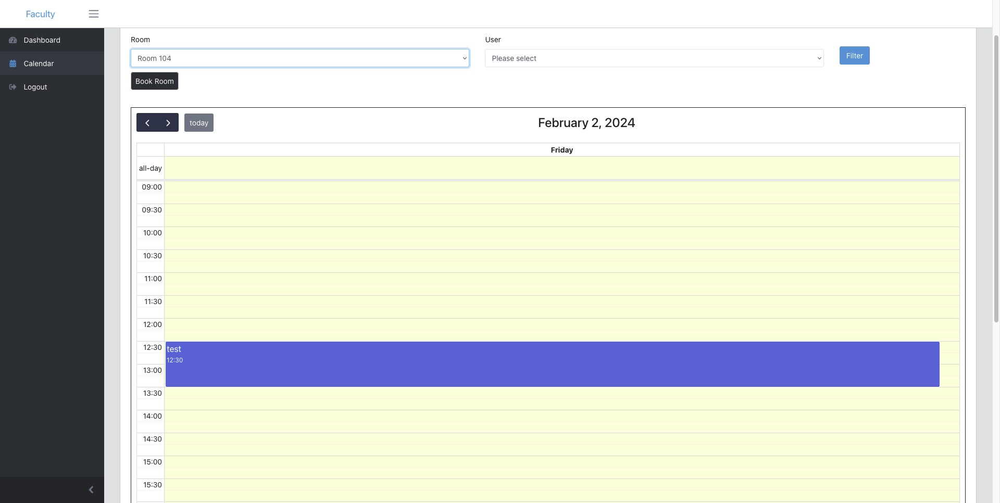


### Admin
1. Login into the site with provided admin credentials.
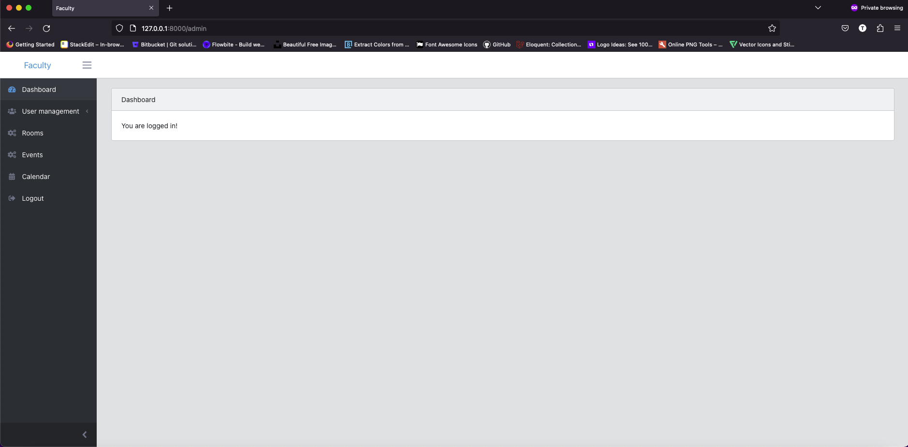
2. Go to **'Events'** to see users bookings.
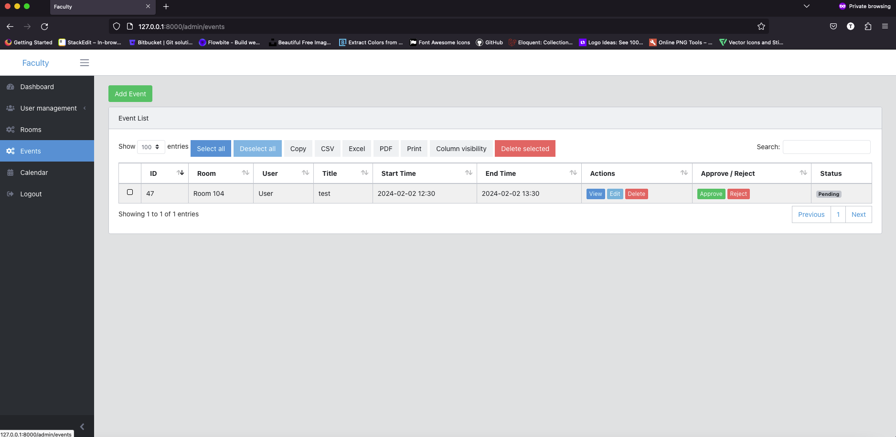
3. An email will be sent to admin whenever users request for a booking.
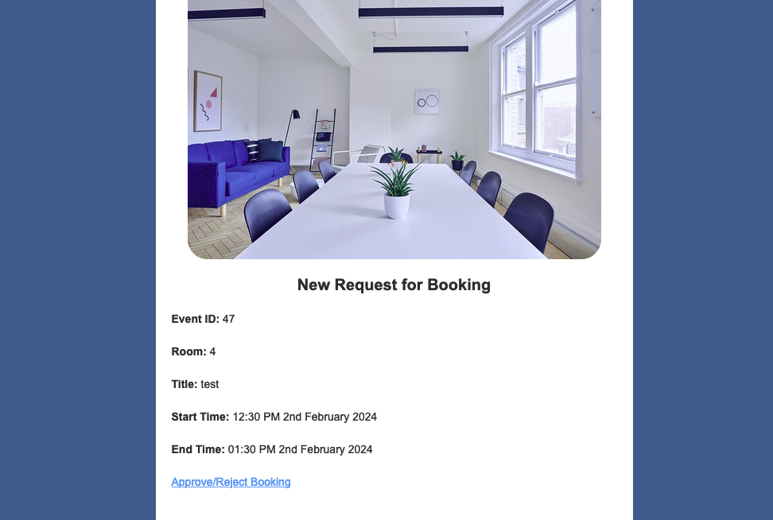
4. Admin can approve or reject user bookings. Admin can also view/edit/delete booking details from users.
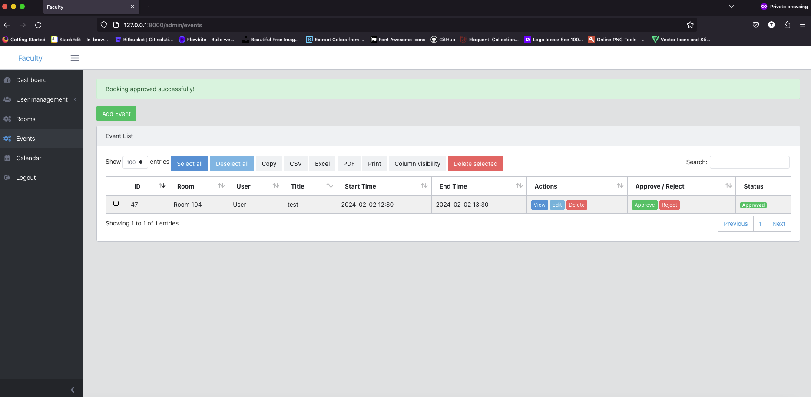
6. It is advisable to **delete** bookings that are **rejected** to clear any slots that were taken. This allows other users to book the same slots.
